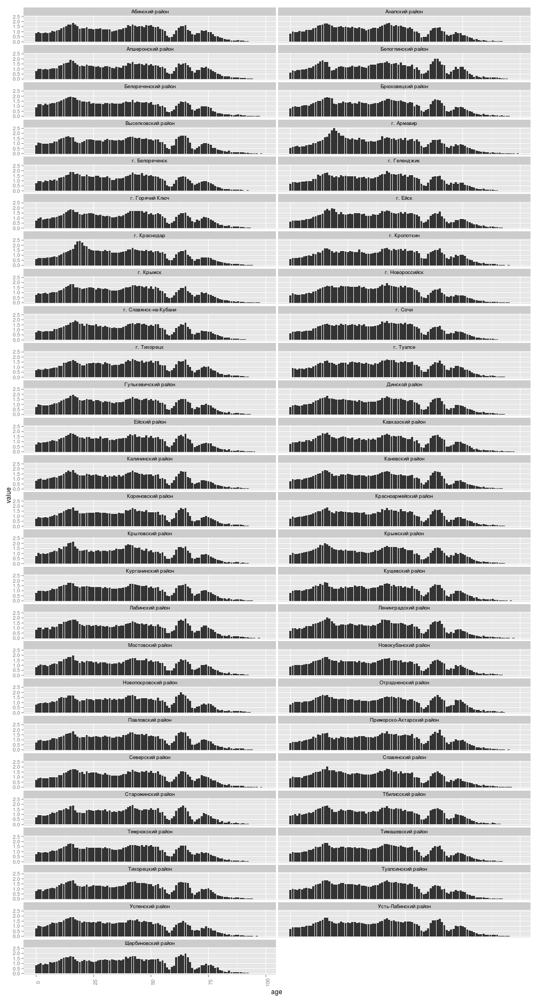
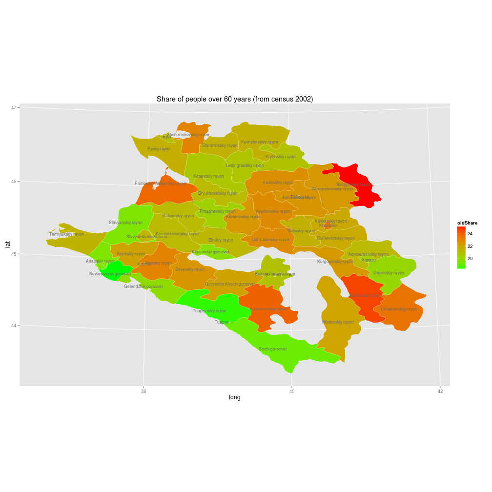
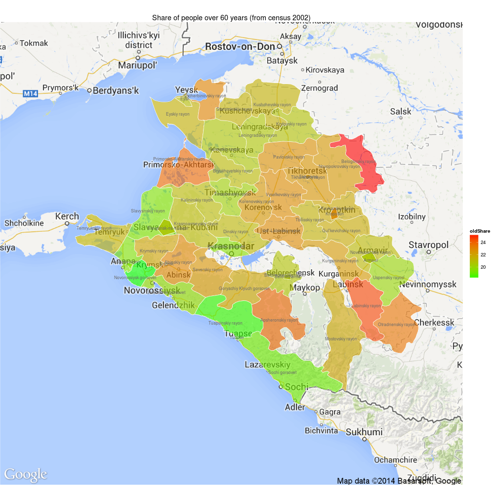
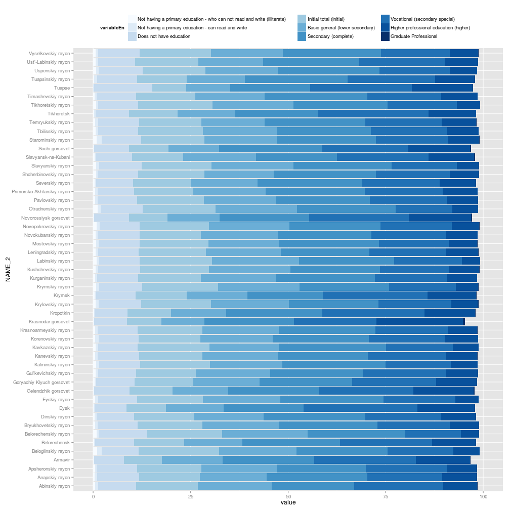
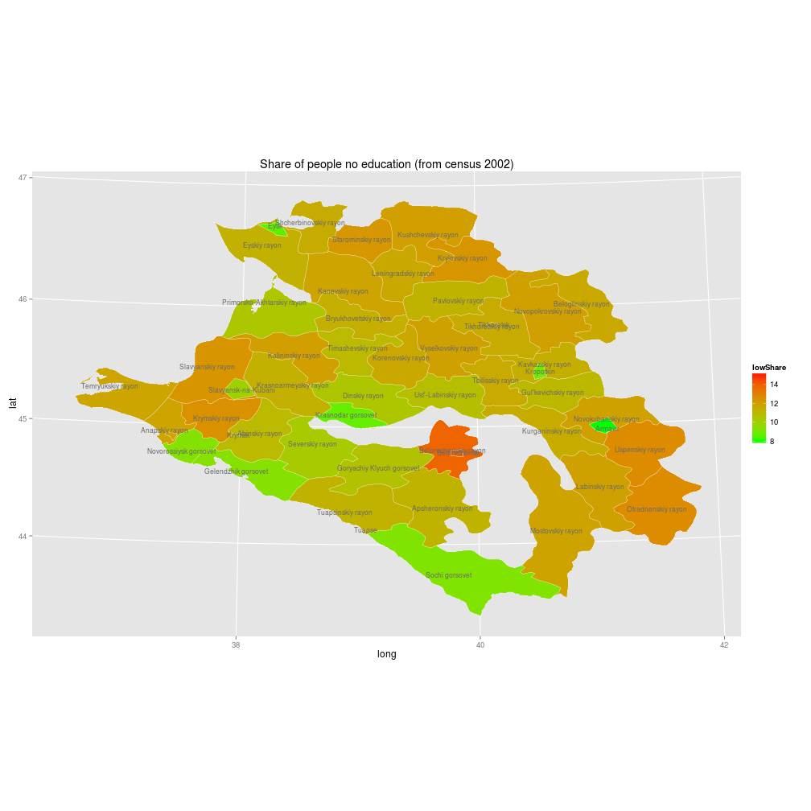
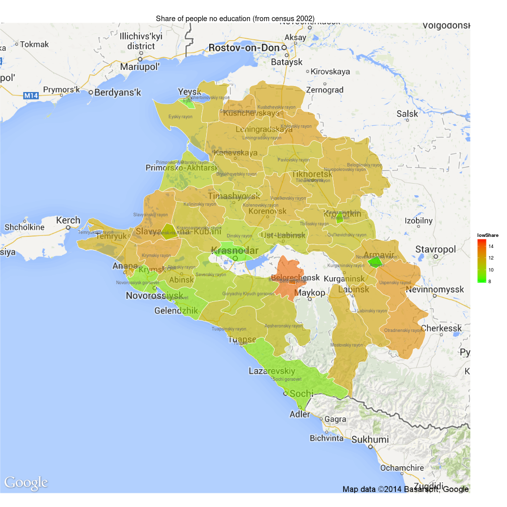
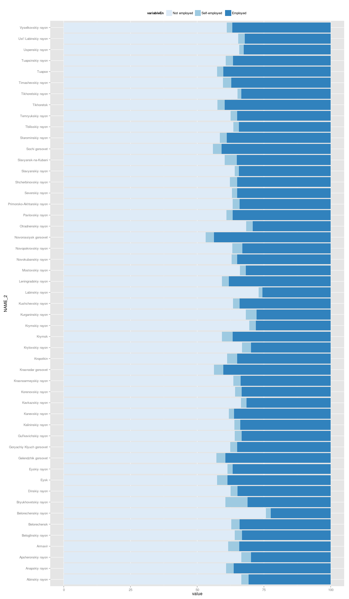
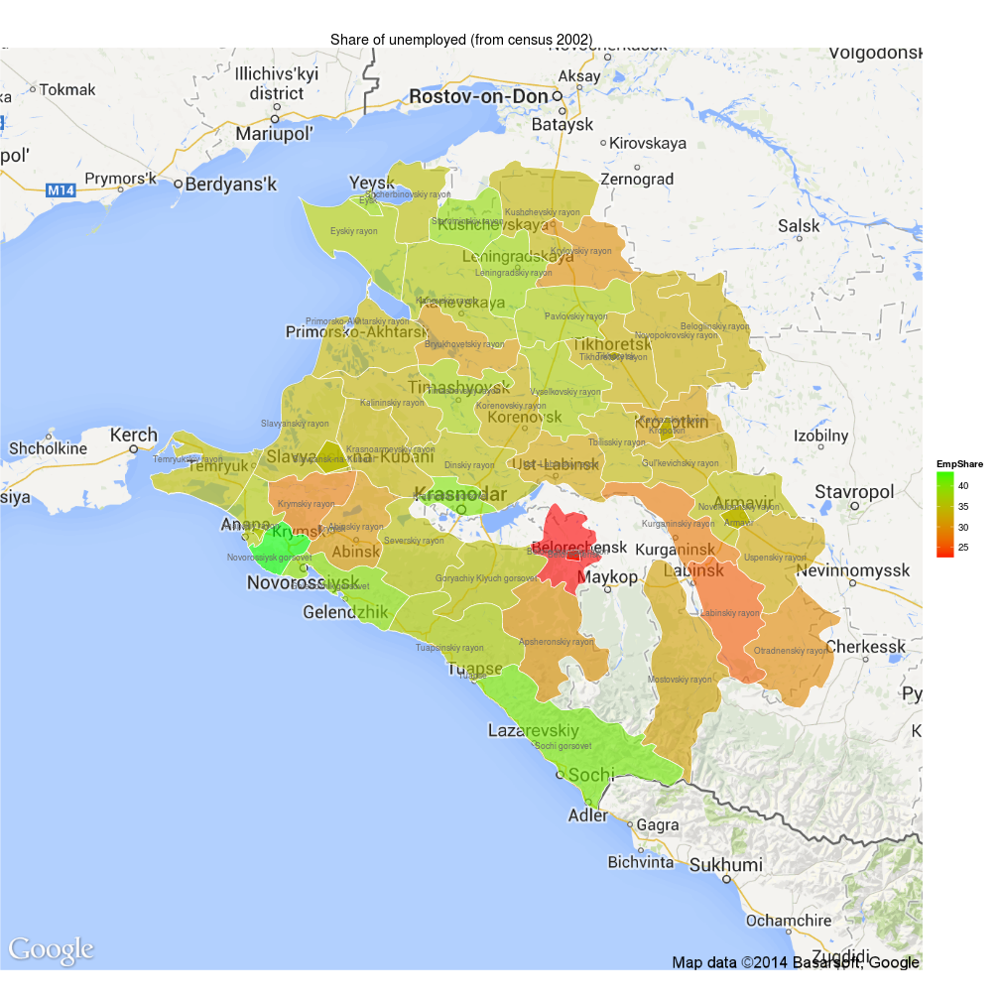

<h1 class="title">Census 2002 & krasnodar & Personal</h1>

# Age of the local population

## Histogram

 

## Share of people over 60 years

 

 

# Education

 

## Low education

Population share of individuals with one of the following level of education: 

- Not having a primary education - who can not read and write (illiterate)
- Not having a primary education - can read and write
- Does not have education

 

 

# Employment

 

## Employment rate

 

